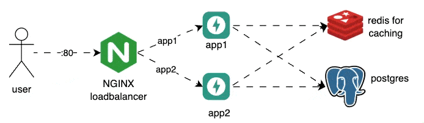
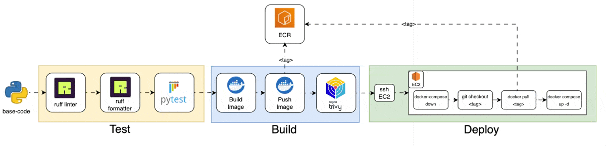

<div align="center">
<!-- image logo -->


# Reverse Geocode
**BUILD YOUR OWN API GEOCODING API FOR INDONESIA**

<br>
</div>

🌏 **Currently only works with data from Indonesia**

Reverse Geocode is an API that takes latitude and longitude as input and returns the corresponding address (Kecamatan/District, Kabupaten/Regency, Provinsi/Province, and Country).
We built this because sometimes you need to geocode `at high speed (> 1 req/second)` for Indonesian locations.
This API is not perfect, but it's fast and works well for most use cases! 🚀


<details>
<summary>This is comparison table for other geocoding APIs (Click to expand):</summary>

| API/Service | Pros | Cons | Price (as of 2025) |
| :-- | :-- | :-- | :-- |
| **Google Maps** | - Industry-leading accuracy (often within 10m) | - Complex, non-linear pricing | \$5.00 per 1,000 requests |
|  | - Global coverage, reliable, well-documented | - Strict usage limits and quotas | Free \$200/month credit for new users |
|  | - Rich metadata (place types, components) | - Cannot store/cache results long-term (license restriction) |  |
|  | - High availability and support | - Expensive at scale |  |
| **Open-source APIs** |  |  |  |
| **Nominatim** | - Free and open-source | - Requires self-hosting for high-volume or commercial use | Free (with OSM data); hosting costs apply |
| (OpenStreetMap) | - No vendor lock-in; flexible data use | - Limited rate on public instance; can be slow |  |
|  | - Good global coverage (depends on OSM quality) | - Data accuracy varies by region |  |
| **OpenCage** | - Built on OSM + other sources; global coverage | - Free tier limited (2,500/day, 1/sec) | Free tier; paid from \$50/month |
|  | - Allows data storage/caching | - Accuracy tied to OSM data; not as rich as Google |  |
|  | - Multilingual, easy integration |  |  |
| **BigDataCloud** | - Generous free tier (60,000/month) | - Forward geocoding not supported | Free (reverse geocode, no key needed) |
|  | - No API key required for free tier | - Accuracy may vary in rural areas |  |
|  | - Fast, boundary-based results | - Less documentation than Google |  |
| **LocationIQ** | - Free tier (5,000/day), global, flexible | - Rate limits (2/sec free), accuracy varies | Free tier; paid from \$50/month |
|  | - Easy to use, supports both forward/reverse geocode | - Not as feature-rich as Google |  |
| **MapQuest** | - Free tier (15,000/month), strong US data | - Attribution required, limited batch support | Free tier; paid plans available |
|  | - Good for US-focused apps | - Less competitive outside North America |  |
</details>

---

## 🛠️ Installation & Setup

You can run the API in two ways: **standalone** or **behind Nginx** (for load balancing or production-like setup).

### 🚀 Run Standalone (No Nginx)

```bash
make up
```
- This uses `docker-compose.yml` and exposes the API at [http://localhost:8080/](http://localhost:8080/).

### 🕸️ Run with Nginx (Load Balancer/Production)

```bash
make up-nginx
```
- This uses `docker-compose.nginx.yml` and runs two app instances behind Nginx.
- Access the API at [http://localhost/](http://localhost/) (port 80).
- Swagger UI is available at `/docs`.



---

## [Deploy to AWS via Github Actions CI/CD](./docs/deployment.md)



[Readmore Here](./docs/deployment.md)

---

## 🧑‍💻 Tech Stack

- 🐍 **Python 3.12+**
- ⚡ **FastAPI** (API framework)
- 🐘 **PostgreSQL + PostGIS** (spatial database)
- 🗺️ **GeoAlchemy2**, **Shapely**, **GeoPandas** (geospatial tools)
- 🧠 **Redis** (caching)
- 🐳 **Docker** & **Docker Compose** (containerization)
- 🌐 **Nginx** (optional, for load balancing/reverse proxy)
- 🧪 **Pytest**, **HTTPX** (testing)
- 📦 **uv** as package manager and depedencies
- 📦 **ruff** as linter and formatter

---

## 🎬 Demo


The demo shows how to use the API to reverse geocode a location in Indonesia with static authentication.

---

## 🗺️ Database Source

The administrative boundaries are sourced from shapefiles and imported into a SQL/PostGIS database.
To convert the shapefile to SQL, check out [`docs/database/convert.py`](docs/database/convert.py) for a step-by-step script.


---

## 📋 To Do

- [x] Add caching
- [x] Add CI/CD
- [x] Add more tests
- [x] Add more documentation
