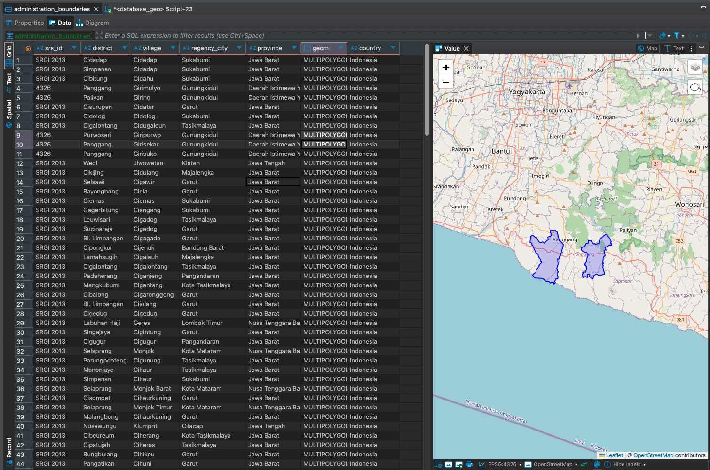

<div align="center">
<!-- image logo -->


# Reverse Geocode

<br>
</div>

🌏 **Currently only works with data from Indonesia**

Reverse Geocode is an API that takes latitude and longitude as input and returns the corresponding address (Kecamatan/District, Kabupaten/Regency, Provinsi/Province, and Country).
We built this because sometimes you need to geocode `at high speed (> 1 req/second)` for Indonesian locations.
This API is not perfect, but it's fast and works well for most use cases! 🚀

---

## 🛠️ Installation & Setup

You can run the API in two ways: **standalone** or **behind Nginx** (for load balancing or production-like setup).

### 🚀 Run Standalone (No Nginx)

```bash
make up
```
- This uses `docker-compose.yml` and exposes the API at [http://localhost:8080/](http://localhost:8080/).

### 🕸️ Run with Nginx (Load Balancer/Production)

```bash
make up-nginx
```
- This uses `docker-compose.nginx.yml` and runs two app instances behind Nginx.
- Access the API at [http://localhost/](http://localhost/) (port 80).
- Swagger UI is available at `/docs`.

---

## 🧑‍💻 Tech Stack

- 🐍 **Python 3.12+**
- ⚡ **FastAPI** (API framework)
- 🐘 **PostgreSQL + PostGIS** (spatial database)
- 🗺️ **GeoAlchemy2**, **Shapely**, **GeoPandas** (geospatial tools)
- 🧠 **Redis** (caching)
- 🐳 **Docker** & **Docker Compose** (containerization)
- 🌐 **Nginx** (optional, for load balancing/reverse proxy)
- 🧪 **Pytest**, **HTTPX** (testing)

---

## 🎬 Demo


The demo shows how to use the API to reverse geocode a location in Indonesia with static authentication.

---

## 🗺️ Database Source

The administrative boundaries are sourced from shapefiles and imported into a SQL/PostGIS database.
To convert the shapefile to SQL, check out [`docs/database/convert.py`](docs/database/convert.py) for a step-by-step script.



---

## 📋 To Do

- [x] Add caching
- [ ] Add CI/CD
- [ ] Add more tests
- [ ] Add more documentation
