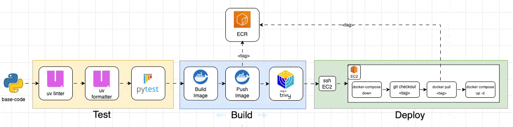
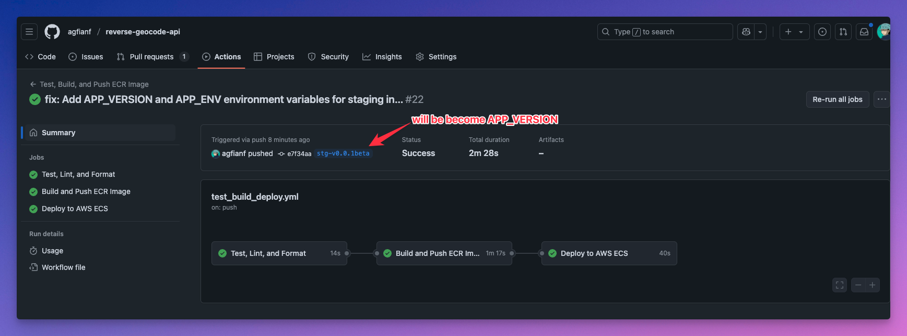
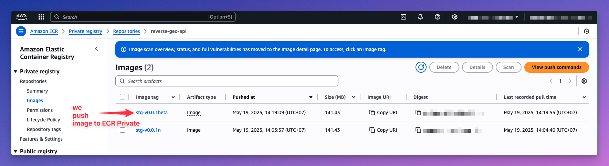
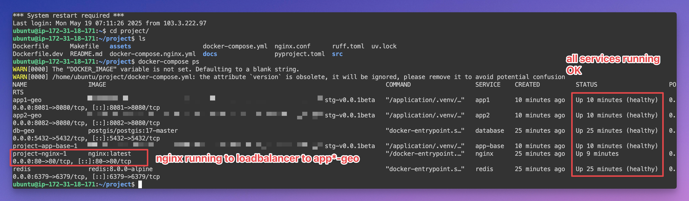
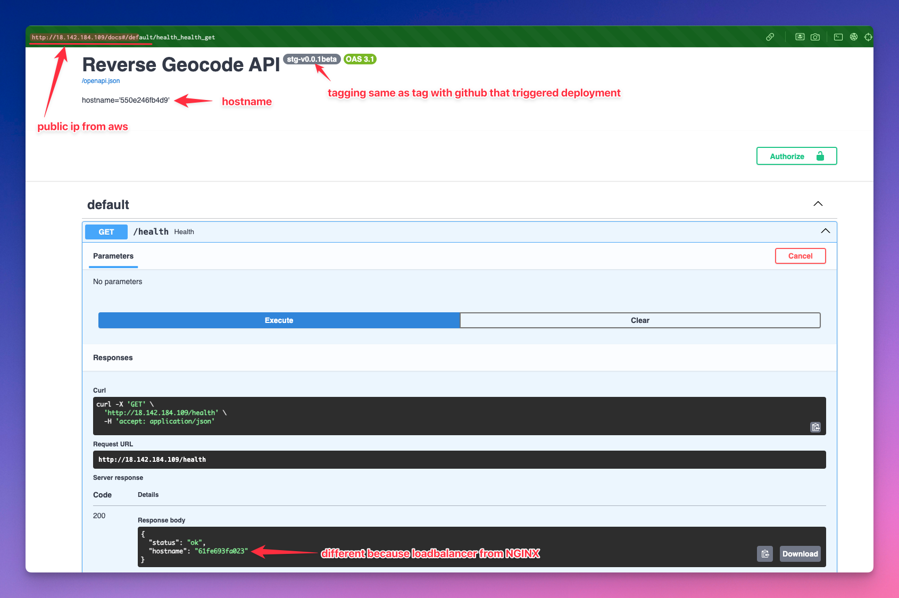

# Deployment to AWS EC2 via Github Actions CI/CD

## Prerequisites

- AWS account with access keys that allow EC2 and ECR operations.
- EC2 instance provisioned (see Terraform section below).
- ECR repository created for Docker images.

## Terraform AWS EC2 Deployment

To provision infrastructure as code (IaC), use Terraform via this [repository](https://github.com/agfianf/terraform-tutorial/tree/main/projects/005-provisioning-ec2-aws).

## Preparation

After your EC2 instance is running:

1. **SSH into your EC2 instance** using its public IP.
2. **Verify Docker and Docker Compose** are installed (these should be set up by the Terraform startup script).
3. **Install AWS CLI** on the EC2 instance if not already present:
   ```sh
   sudo apt-get update
   sudo apt-get install -y awscli
   ```
4. **In AWS Console:**
   - Attach an IAM Role to your EC2 instance with permissions to access ECR.
   - Create an ECR repository for your Docker images.

## Github Actions: Secrets and Variables

Set the following secrets and variables in your Github repository (Settings > Secrets and variables):

| Variable              | Description                                 |
|-----------------------|---------------------------------------------|
| APP_PATH              | Path to put the code app inside the EC2 instance |
| AWS_ACCESS_KEY_ID     | Your AWS access key ID                      |
| AWS_REGION            | Your AWS region                             |
| AWS_SECRET_ACCESS_KEY | Your AWS secret access key                  |
| IMAGE_REGISTRY        | Your ECR registry URI                       |
| IMAGE_REPOSITORY      | Your ECR repository name                    |
| REDIS_PASSWORD        | Your Redis password                         |
| SSH_HOST              | Your EC2 instance public IP                 |
| SSH_PRIVATE_KEY       | Your EC2 instance private key               |
| SSH_USER_NAME         | Your EC2 instance user name                 |

## CI/CD Workflow

### Trigger

The workflow is defined in `.github/workflows/test_build_deploy.yml` and is triggered on:

- **Pull Requests** to the `main` branch (runs tests, lint, and format only).
- **Pushes** with tags starting with `stg-v` or `prod-v` (runs full pipeline: test, build, push, deploy).

### Workflow Steps

The workflow consists of three main stages:

1. **Test**
   - Runs linter, formatter, and tests (pytest) to ensure code quality.
2. **Build**
   - Builds the Docker image and pushes it to the specified ECR repository.
   - Runs a vulnerability scan (Trivy) on the built image.
3. **Deploy**
   - Connects to the EC2 instance via SSH.
   - Pulls the latest Docker image from ECR.
   - Stops and removes old containers.
   - Updates the codebase (git pull/checkout).
   - Starts the application using Docker Compose.

### Overview Diagram




### Manual Verification Steps

After the workflow completes successfully:

1. **Check CI/CD Workflow Status**
   - All steps should be green in Github Actions.
   - 
2. **Verify ECR Repository**
   - The new image tag should be present in your ECR repository.
   - 
3. **SSH into EC2 and Check Docker**
   - Run `docker ps` to ensure containers are running.
   - 
4. **Access the API**
   - Open `http://<ec2-public-ip>/docs` in your browser to see the Swagger UI.
   - 

---

**Tip:**
If you encounter issues, check the Github Actions logs for errors, and SSH into your EC2 instance to inspect Docker logs with `docker logs <container_id>`.
